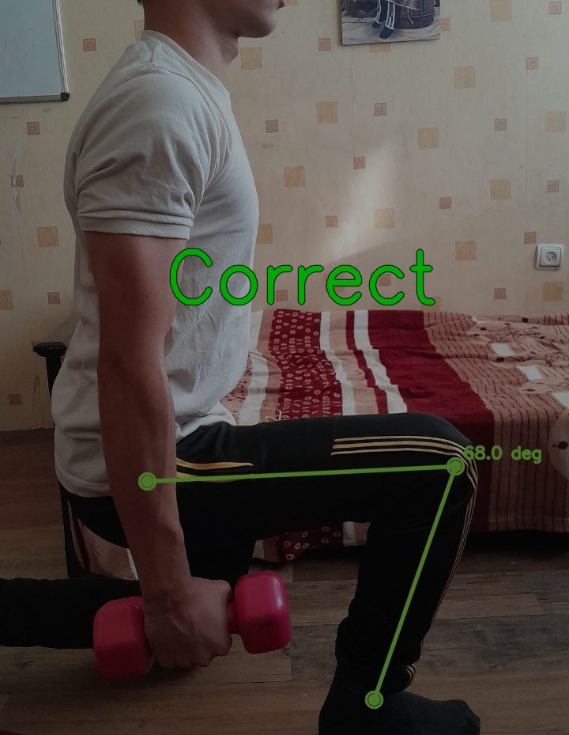
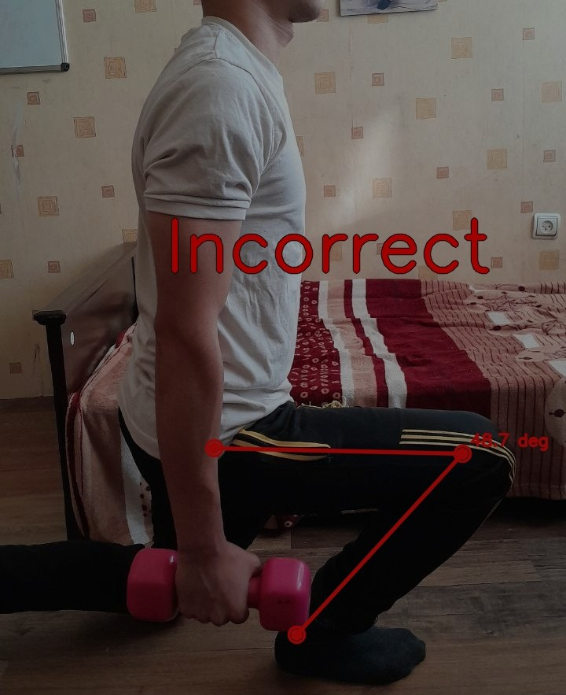

# Real-Time GYM Exercise Pose Correction with YOLO & OpenCV

A real-time workout form-correction system built using **YOLO Pose**, **Python**, and **OpenCV**.
The model detects your joints, analyzes your body angles, highlights and incorrect exercise forms instantly.


## Project Preview


### 🔹 Detecting Angles







## Features

-   ✔ Real-time pose detection using **YOLOv8 Pose**
-   ✔ Angle calculation for each joint
-   ✔ Detects incorrect movements (shows red joint/line)
-   ✔ Automatic side detection (right/left)
-   ✔ Exercise rules system (each exercise has its own logic)


## Supported Exercises

-   Bicep Curl\
-   Shoulder Press\
-   Lunge\
-   *(Add more easily using the modular rule system)*


## Add Exercise

-   Open src/exercises.py
-   Add your exercise to the exercises list


## Exercise Details

Each exercise object has the following fields:
-   id: Unique identifier for the exercise
-   name: Name of the exercise
-   leftChecks: List of joint IDs on the left side of the body used for analysis
-   rightChecks: List of joint IDs on the right side of the body used for analysis
-   important: Make sure the order of joint IDs in leftChecks and rightChecks matches. For example, the right ear and left ear IDs must have the same index in their respective lists.
-   twoSide:
  1. True → scan both sides of the body
  2. False → scan only the side closer to the camera automatically
-   rules: List of rules that guide your exercise form evaluation
-   draws: List of visual guides to display on the real-time correction camera

## Rules
Currently, two types of rules are implemented. You can add more rules for better guidance.

-   ### make_angle_rule
  -   Takes three joint indices from your exercise’s joint lists.
  -   define minimum and maximun angle that is corect
  -   Define minimum and maximum angles to specify the correct range.
  
-   ### make_x_rule
  - Takes two joint indices from your exercise’s joint lists.
  - Calculates the distance between these two joints along the X-axis.
  - Define the MSE threshold. If the calculated value is larger than this number, the position is considered incorrect.


## Installation

``` bash
git clone https://github.com/YOUR-USERNAME/YOUR-REPO.git
cd YOUR-REPO
pip install -r requirements.txt
```


## Credits

-   Developed by **Shervin**
-   Built for fun, fitness, and learning 😄


