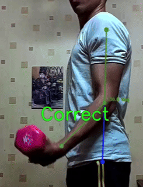
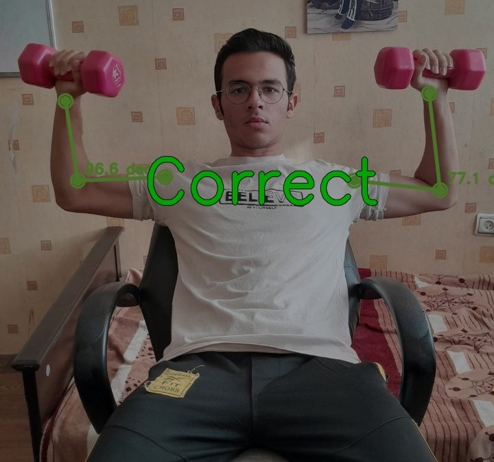
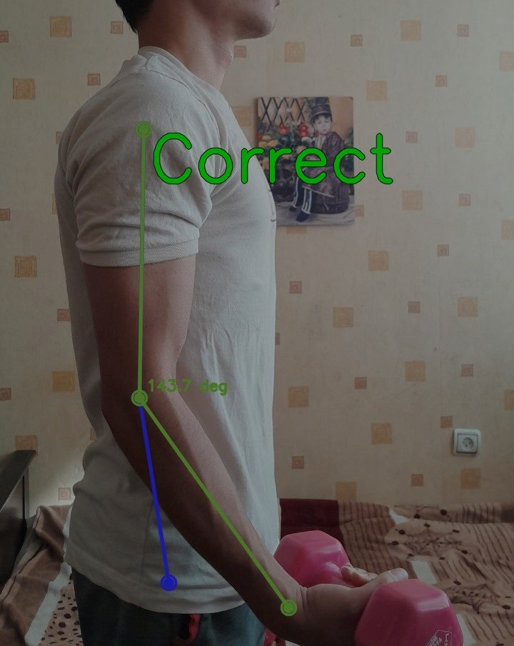
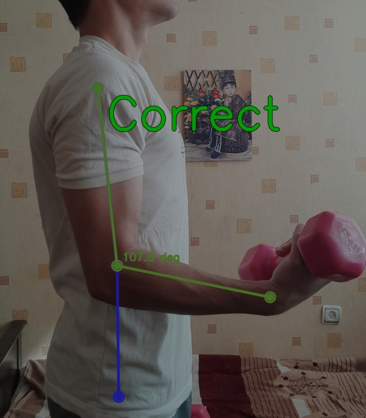
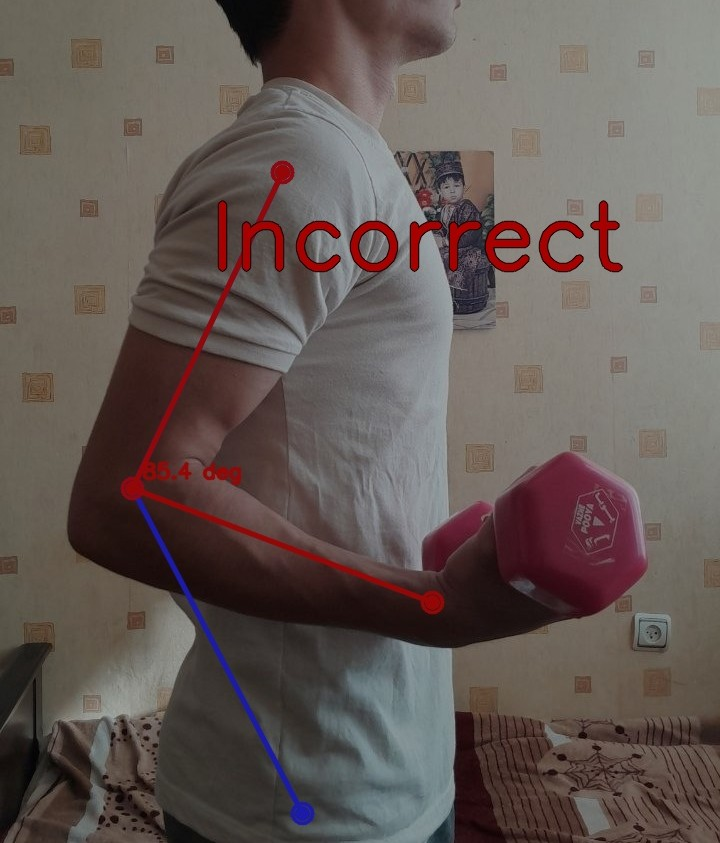

# Real-Time GYM Exercise Pose Correction with YOLO & OpenCV

A real-time workout form-correction system built using **YOLO Pose**, **Python**, and **OpenCV**.
The model detects your joints, analyzes your body angles, highlights and incorrect exercise forms instantly.

------------------------------------------------------------------------

## Project Preview



### 🔹 Detecting Angles










------------------------------------------------------------------------

## Features

-   ✔ Real-time pose detection using **YOLOv8 Pose**
-   ✔ Angle calculation for each joint
-   ✔ Detects incorrect movements (shows red joint/line)
-   ✔ Automatic side detection (right/left)
-   ✔ Exercise rules system (each exercise has its own logic)

------------------------------------------------------------------------

## Supported Exercises

-   Bicep Curl\
-   Shoulder Press\
-   Lunge\
-   *(Add more easily using the modular rule system)*

------------------------------------------------------------------------

## Installation

``` bash
git clone https://github.com/YOUR-USERNAME/YOUR-REPO.git
cd YOUR-REPO
pip install -r requirements.txt
```

------------------------------------------------------------------------

## Credits

-   Developed by **Shervin**
-   Built for fun, fitness, and learning 😄

